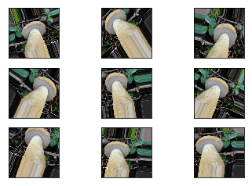
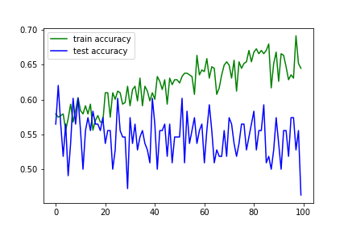
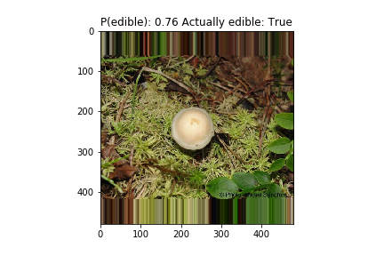
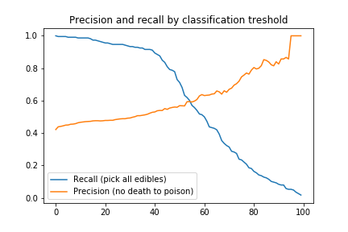

```{r setup, include = FALSE}
knitr::opts_chunk$set(echo = FALSE)
```

# Introduction

Deep Shrooms is a project by three students from the University of Helsinki (HY): Teemu Koivisto, Tuomo Nieminen, Jonas Harjunpää. The project relates to the HY course module 'Introduction to Data Science' (fall 2017). The goal of the project is to develop a smartphone application to classify wild mushrooms to poisonous/edible based on image input from the users camera.  

The project uses tools of data wrangling, machine learning and interactive application design. The project naturally splits into three parts: (1) retrieving and transforming data, (2) training a classifier, (3) building an interactive application.

In this blog post, we'll describe our project. We'll showcase our classifiers correctness using summary statistics that communicate the accuracy and predictive power of our model. We'll pay close attention to possible false edibles: we do not wish users of our app to end up eating poisonous mushrooms. We hope that the app would be a fun tool for the curious mushroom hunter. 

The [code](https://github.com/TuomoNieminen/deep-shrooms) for the project lives in GitHub. 

## Domain introduction

Muhsrooms can be classified into several categories based on edibility. Reasons for not wanting to eat a mushroom include poor taste and poison. Correct classification of a found mushroom is a basic problem that a mushroom hunter faces.

- The hunter wishes to avoid inedible and poisonous mushrooms
- The hunter wishes to collect edible mushrooms

Further classification according to taste is also possible and in some cases poison can be removed by cooking.  

Humans are generally very good at categorizing items based on appearance and other available information. Based on expert knowledge, the following information is useful for mushroom classification:

1) Where the mushroom grows: is it on the ground or on wood.  
1.1) If it grows on ground it could be a saprotroph of detritus (karikkeen lahottaja), mycorrhiza (juurisieni) which is specific type of mushroom living from the roots of a tree or it could still be a saprotroph of a tree but the wood is on ground level.  
1.2) If it grows on wood consider if it's conifer (havupuu) or hardwood (lehtipuu). Some species grow on only a very specific wood like oak.  
2) Underneath the mushroom cap there can be different types of gills in various combinations.  
3) Surface of the cap is a very good classifier of the mushroom. The structure might not be possible to know from a picture.  
4) Color of the mushroom varies a lot depending on the humidity and the age of the mushroom. When raining the colors get deeper and more distinctive. Young mushrooms have stronger colors than old ones. Sunlight might diminish the colors.  
5) Stipe (*jalka* in Finnish) of a mushroom can also indicate a lot of information from the mushroom. Thin and thick shapes are more distinctive than average size.  
6) Geographic location of the mushroom could be useful as some species probably don't grow everywhere in Finland.
7) Smell and touch could also help in classification.  


## Technical introduction

The specific goal of our project is to create a smartphone application which classifies user inputted pictures of mushrooms to edible or not edible, using a machine learning classifier based on a convolutional neural network (CNN). CNN:s are the current state-of-the-art in image recognition. 

To train such a classifier, we'll need large amounts of pictures of previously classified mushrooms to use as examples. We cannot simply use any pictures of mushrooms, since they have to include a reliable edibility tag. A name tag could be enough, since edibility could be separately retrived based on the name. We'll also have to normalize the size and shape of any pictures we'll find, since usually classification algorithms expect prespecified input sizes.

We do not expect to be able to explicitly extract the influential features introduced in the previous section. We will only use images as input information for our classifier, so features such as smell and location will not be used. However, we do expect our model to be able to impicitly extract some of the influential features related to appearance. This is because a CNN performs feature extraction implicitly based on an input image, using it's convolutional layers. It is "simply" a matter of defining the structure of the network in such a way that the network is able to extract the information it needs for the classification task.

As already mentioned, we'll have to pay close attention to the possibility of false edibles. Instead of simply outputting a binary class, we'll instead provide the user with the *probability* of having an edible mushroom in their hands. If the user finds that the probability of edibility is high, the user can decide to collect the mushroom and do further reseach at home. Our app is therefore a tool for deciding whether to collect a mushroom, not a tool for deciding whether to eat the mushroom.


# Retrieving and transforming data

www.mushroom.world contains a large database of mushroom pictures and information such as edibility status. The database is not directly accessible, so we build a web scraped which retrieves muhsroom information from the website. For each mushroom, we also collected the URL:s for the available images of the mushroom and then downloaded the images. We also collected the mushroom names in English and Latin and used another data source to retrieve the names in Finnish. We were able to retrieve 536 pictures of 166 different mushrooms as a base data-set.

In mushroom.world, the edibility of mushrooms was classified into 7 different classes: "edible", "edible and good", "edible and excellent", "not edible", "edible when cooked", "poisonous", "lethally poisonous". Due to the small amount of available data, we decided to treat the problem as a binary classification task and narrowed the edibility status down to edible or non-edible. We categorized "edible when cooked" as non-edible, which means that in our definition, an "edible" mushroom requires no preprocessing and is always safe to eat. 

The images and the metadata are stored in both Google Drive and Amazon S3. The original pictures were very good quality and therefore took a lot of space. We used .jpg compression and resized the images. In the original set of images, the sizes varied quite a lot. To solve this, we standardized the pictures to the size of 480x480, by padding the missing size with the edge values. The images were colored, so more specifically a single image is represented by three stacked 480x480 matrices (one for each of red, green and blue values in the picture) with values between 0 and 255. To avoid numerical problems in training our model, we changed the representation from the original scale of 0-255 to a scale between 0-1.

# Using augmentation to artificially increase the amount of data

Our mushroom dataset contains some hunderds of pictures. It is however well known that deep learning methods start to work well when them amount of data is quite a lot more, preferably in the tens of thousands if not millions of examples. We were well off the mark.

We decided to "cheat" by artificially increasing the number of unique training examples by introducing small distortions to the images. We used the **keras** deep learning library to build an image generator which, instead of the original images, produces an infinite stream of randomly altered images.

```{r, out.width = "600px", out.height = "600px", fig.cap = "Examples of the image augmentation strategy used"}

```

# Our CNN model architecture

Our classifier is a convolutional neural network (CNN) consising of 

- 3 convolutional layers, each followed by a pooling layer  
- A fully connected layer  
- An output layer with a single node, outputting a probability value  

The architecture of our model is visualized in the picture below. The architecture was derived by a combination of examples and recommendations and our own experimentation.

<br>

```{r, out.width = "350px", fig.cap = "Architecture of our CNN"}
knitr::include_graphics("model.png")
```

## Convolutional layers

The convolutional layers of the network are essential, as their goal is to learn to recognize and extract the important features in the input images. Techically, the convolutional layers use matrix convolution for this task. A matrix convolution is a linear operation which transforms the input by 
"sliding" a 3 x 3 convolution matrix (in our case) over the input array and produces a new *feature map*, i.e. a new representation of the input. 
For colored images, the convolution matrix first looks at the area in the upper left corner of size (3,3,3) and produces a single output 
by performing a matrix multiplication over that area.
It then moves one pixel to the right and does the same, and continues over the whole image.

The above operation results in a (478, 478, 1) feature map; a new representation of the input images. 
The representation depends on both the inputted images and the values in the convolution matrix, treated as parameters in the network. 
The parameters are estimated during training to produce the optimal feature maps.

The depths of our three convolutional layers are 32, 64 and 64. 
This means that in the first layer, the convolution operation is performed separately 32 times by 32 different convolution 
matrices, producing a feature map of size (478, 478, 32). In the second and third convolutional layers, the operation is performed 64 times. 

## ReLU activation and max pooling

Each convolutional layer is followed by a *rectified linear unit* (ReLU). ReLU is simple nonlinear function wich outputs:  

`max(0, input)`  

The purpose of the relu activation is to introduce nonlinearity to the feature maps. 
The matrix convolution is a linear operation and most interesting aspects of images are usually nonlinear. 

Each convolution is also followed by *pooling*, which is a simple way to reduce the dimensionality of the problem and threfore help in generalisation.
We used max pooling with pool size (2,2), which halves the input in both vertical and horizontal dimensions by outputting the maximum value of two disjoint consequent values in the feature map.

## Dense layers and output

After the three convolutional layers, our model has a fully connected layer with 64 nodes. This means that each node uses the output of each previous node in a linear equation. Each node then uses a ReLU activation to introduce nonlinearity. 

Finally, a single output node connects to each of the previous fully connected 64 nodes. Linear equations are again followed by a nonlinear one, this time the sigmoid function, which outputs values between 0 and 1. Since our target is binary (edible or not), these values can be interpret as probabilities, and they can be used for predicting the class of the image. A natural choice is to predict a mushroom as eatable, if the probability of it being eatable is at least 0.5. This is not the only possible choice, however, as one might wish to be more conservative to avoid collecting poisonous mushrooms.

# Training the network

The image data was splitted to training and testing sets with a split of 80% to 20%. The CNN was then trained by feeding it small batches of augmented image data from the training set, 32 images at a time. Each slightly altered image was passed through the network a 100 times, i.e. the network was trained on 100 *epochs*.  

The picture below shows both the training and testing accuracy for each of the epochs. It can be seen that while the training accuracy has an increasing trend, the testing accuracy averages a steady 55% accuracy, which is remarkably poor. 

```{r, out.width = "600px", fig.cap = "Training and testing accuracy of our CNN by epoch"}

```

It should be noted that an identical network was trained with the same strategy but possibly different training and testing data, and that network achieved higher testing accuracy (the same network was trained again to display the training history above). It is quite possible that due to the small amount of data, the training set might not include suitable examples of all eatable and non-eatable mushrooms available in dataset, which would naturally affect performance.


# Model predictions

Once the network has been trained, it can be used to make predictions. Our model outputs a single value describing the probability that a mushroom is eatable.

```{r, out.width = "600px", out.height = "400px", fig.cap = "An example of a prediction of the CNN"}

```

## Precision and recall

Since our model outputs a probability for edibility, the user can make a choice to only pick mushrooms that have a very high probability of edibility. The higher the probability treshold the mushroom hunter chooses, the less likely it is that the hunter will collect a poisonous or an inedible mushroom (high precision). However, the tradeoff is that with a high probability treshold, the hunter is also more likely to leave some edible mushrooms in the forest (low recall).

The picture below shows the precision and recall of our classifier, by the probability treshold chosen. 

```{r, out.width = "600px", fig.cap = "Precision and recall of our mushroom classifier by the probability treshold. The probabilities are given in percentages in the x axis."}

```


# Building the app

We created a demo-app using React as frontend and Flask as a backend that loads the imported model and classifies the pictures as they come. The app can be found [here](https://teekoivi.users.cs.helsinki.fi/). The user can select a file to give to the app and the app predicts a propability of the mushrooms edibility. The page also contains some example images with links. By clicking on a example image the app calculates the propability for them.

Building the app was quite time consuming. React-Native wasn’t as straight-forward as we thought it would have been.Serving the model was also complicated. Tensorflow-serving was probably the “best” way of doing it but super-difficult to use.

[The app](https://teekoivi.users.cs.helsinki.fi/)

# Sources

- [Intuitive explanation of CNNs](https://ujjwalkarn.me/2016/08/11/intuitive-explanation-convnets/)  
- [Sienten tunnistaminen](http://www.funga.fi/teema-aiheet/sienten-tunnistaminen/)  
- [CNN binary classification tutorial using litte data](https://blog.keras.io/building-powerful-image-classification-models-using-very-little-data.html)  
